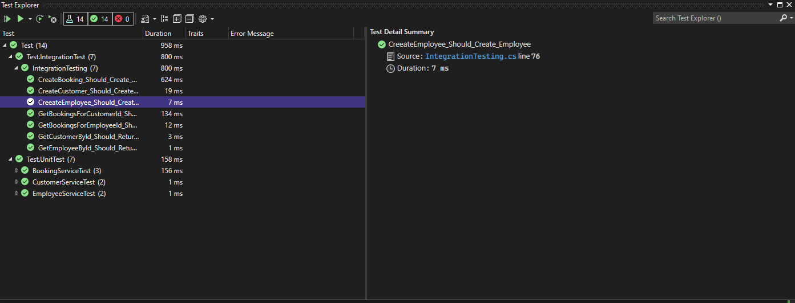

# TestAssignment3
#### Made by: ####

* Phillip Thomas Isenborg Andersen, cph-pa124@cphbusiness.dk
* Sumit Dey, cph-sd152@cphbusiness.dk


### Setup

**Step 1: Run the the command docker-compose up -d on the .yml file**

    ├── ...
    ├── Docker-postgres
    │   ├── docker-compose.yml        
    │   ├── ...       
    │   └── ...                
    └── ...

**Step 2: Open the project solution Test Assignment 3.sin as shown below in the directory tree:**
```
├── Docker-postgres
├── Test Assignment 3
├── Test
├── README.md
├── Test Assignment 3.sln
```
> :warning: Make sure that you use visual studio 2022 and not visual studio code
> 
**Step 3: Run the the program and the database will be automatically be created since migration is added**

**Step 4: Right click on the test project and press "Run tests"**


### Test results ###

<p align="center">
  
</p>
